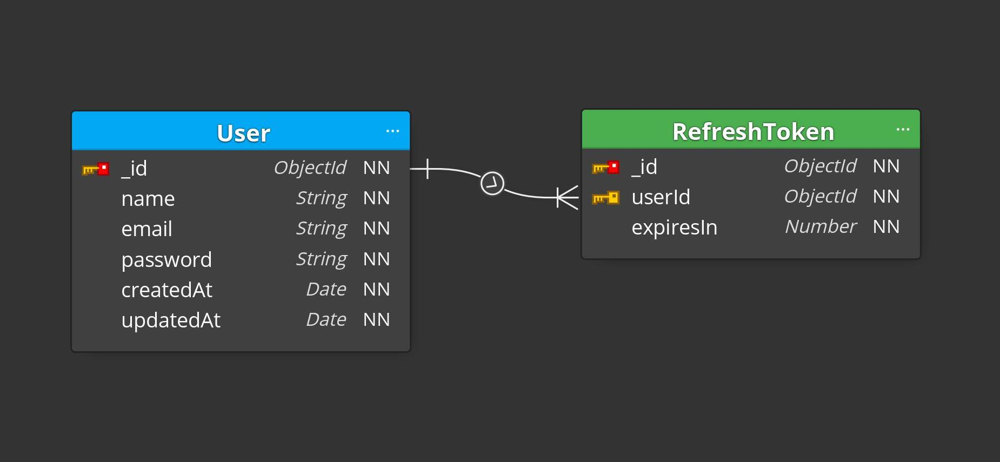

<h1 align="center">
  Node JWT Auth
</h1>

<p align="center">
  

  <a href="https://www.linkedin.com/in/dev-gabriel-cordeiro/">
    
  </a>
  
  
  
  
</p>

<p align="center">
  <a href="#-about-the-project">About the project</a>&nbsp;&nbsp;&nbsp;|&nbsp;&nbsp;&nbsp;
  <a href="#-technologies">Technologies</a>&nbsp;&nbsp;&nbsp;|&nbsp;&nbsp;&nbsp;
  <a href="#-license">License</a>
</p>

## 👨🏻‍💻 About the project

This is an API with basic user authentication features such as sign up, sign in, logout and others.

<h1 align="center">
  
</h1>

## 🚀 Technologies

Technologies that I used to develop this API

- [Node.js](https://nodejs.org/en/)
- [TypeScript](https://www.typescriptlang.org/)
- [Express](https://expressjs.com/)
- [Mongoose](https://mongoosejs.com/)
- [Json Web Token](https://jwt.io/)
- [Bcryptjs](https://github.com/dcodeIO/bcrypt.js)
- [Jest](https://jestjs.io/)
- [SuperTest](https://github.com/visionmedia/supertest)
- [Eslint](https://eslint.org/)
- [Babel](https://babeljs.io/)

### Requirements

- [Node.js](https://nodejs.org/en/)
- [Yarn](https://classic.yarnpkg.com/) or [npm](https://www.npmjs.com/)
- One instance of [MongoDB](https://www.mongodb.com/)

**Clone the project and access the folder**

```bash
$ git clone https://github.com/GabrielCordeiroDev/node-jwt-auth
$ cd node-jwt-auth
```

**Follow the steps below**

```bash
# Install the dependencies
$ yarn

# Make a copy of '.env.example' to '.env'
# and set with YOUR environment variables
$ cp .env.example .env

# To finish, run the api service
$ yarn dev

# Well done, project is started!
```

## 📝 License

This project is licensed under the MIT License - see the [LICENSE](https://github.com/GabrielCordeiroDev/node-jwt-auth/blob/main/LICENSE) file for details.
